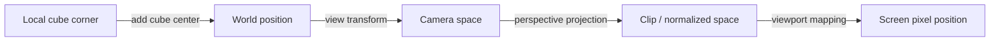
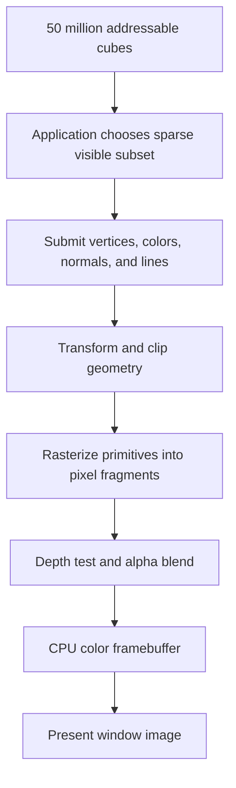
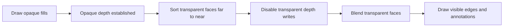
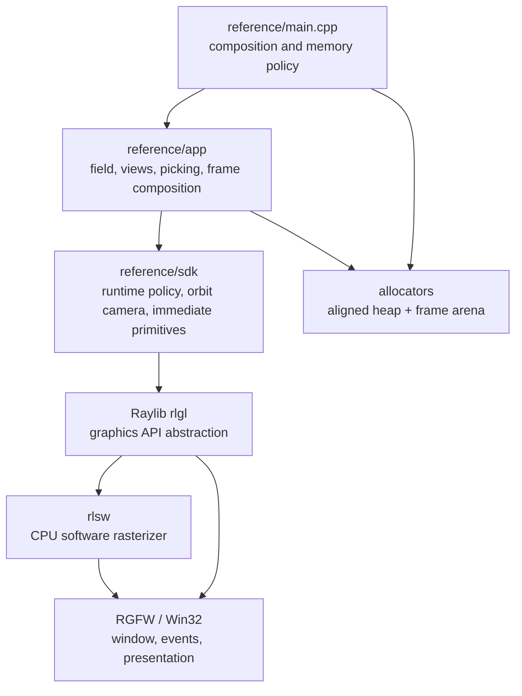
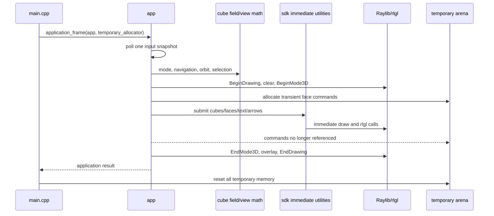
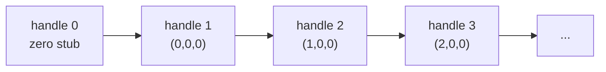
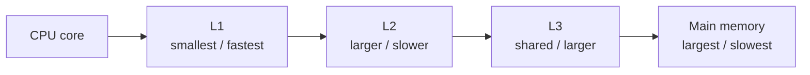
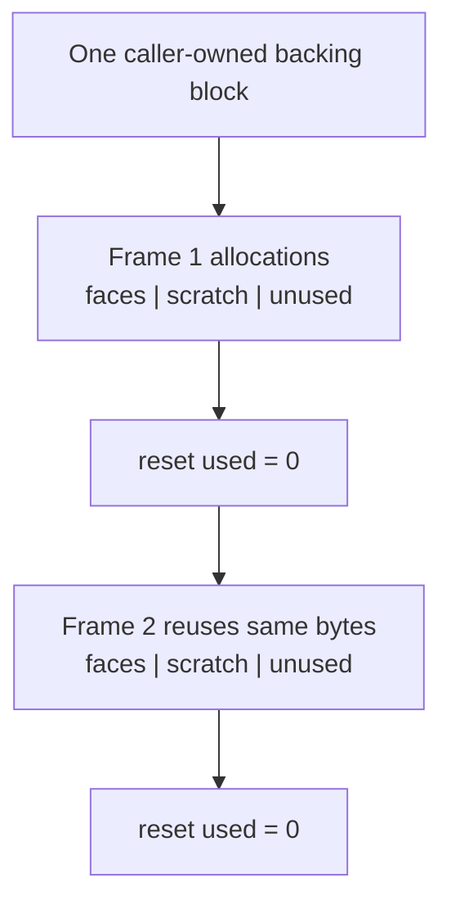
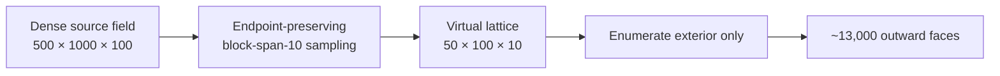
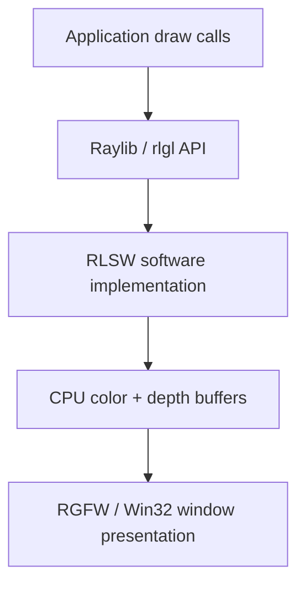

# Software-Rendered Cube Field

## Project architecture and graphics guide

This report explains what the project does, why it is structured as it is, and
how a three-dimensional scene becomes pixels in a window. It is written for a
reader who is new to graphics programming. The early sections establish the
graphics vocabulary; later sections connect each idea to the finished source
under `reference/`.

The document describes the definitive reference implementation as it exists on
July 11, 2026.

> **Source roles:** `reference/` is the independent, finished implementation
> documented here. `src/` is the learner's checkpoint-by-checkpoint rebuild and
> intentionally does not yet contain every module or feature described below.
> The Git tag `baseline` is historical design evidence, not the current oracle.

> **Core idea:** the application describes a world containing 50 million
> possible cubes, but it never attempts to draw all 50 million. It derives cube
> positions mathematically, reads only the values needed by the current view,
> submits a sparse set of visible geometry, and asks Raylib's `rlsw` backend to
> rasterize that geometry on the CPU.

## Outline

The report follows the project from the outside inward:

1. Establish the goal, user experience, and non-goals.
2. Explain the graphics pipeline from 3D coordinates to screen pixels.
3. Show where Raylib and its software renderer fit.
4. Walk through the source architecture and one complete frame.
5. Explain the cube data, handles, palettes, and cache-oriented layout.
6. Explain cameras, controls, picking, and the two rendering views.
7. Explain immediate-mode drawing, depth, transparency, text, and edges.
8. Explain allocation strategy and performance choices.
9. Provide build, test, documentation, and source-reading guides.

## Table of contents

- [1. Executive summary](#1-executive-summary)
- [2. Goals and non-goals](#2-goals-and-non-goals)
- [3. Graphics rendering 101](#3-graphics-rendering-101)
  - [3.1 A frame is an image](#31-a-frame-is-an-image)
  - [3.2 Coordinate spaces](#32-coordinate-spaces)
  - [3.3 The 3D rendering pipeline](#33-the-3d-rendering-pipeline)
  - [3.4 Triangles quads and cubes](#34-triangles-quads-and-cubes)
  - [3.5 Rasterization](#35-rasterization)
  - [3.6 Depth testing](#36-depth-testing)
  - [3.7 Transparency and blending](#37-transparency-and-blending)
  - [3.8 The camera](#38-the-camera)
  - [3.9 CPU versus GPU rendering](#39-cpu-versus-gpu-rendering)
- [4. How graphics 101 applies here](#4-how-graphics-101-applies-here)
- [5. User experience and controls](#5-user-experience-and-controls)
- [6. System architecture](#6-system-architecture)
  - [6.1 Layer diagram](#61-layer-diagram)
  - [6.2 Module map](#62-module-map)
  - [6.3 Dependency direction](#63-dependency-direction)
- [7. Application lifecycle and frame loop](#7-application-lifecycle-and-frame-loop)
- [8. Data model](#8-data-model)
  - [8.1 The implicit cube field](#81-the-implicit-cube-field)
  - [8.2 One-based handles and zero stubs](#82-one-based-handles-and-zero-stubs)
  - [8.3 Cube values](#83-cube-values)
  - [8.4 Palettes and edge colors](#84-palettes-and-edge-colors)
  - [8.5 Data orientation and cache behavior](#85-data-orientation-and-cache-behavior)
- [9. Memory architecture](#9-memory-architecture)
  - [9.1 Persistent and temporary memory](#91-persistent-and-temporary-memory)
  - [9.2 Caller-controlled allocators](#92-caller-controlled-allocators)
  - [9.3 Arena allocation](#93-arena-allocation)
- [10. Input camera and navigation](#10-input-camera-and-navigation)
- [11. Cube picking](#11-cube-picking)
- [12. Rendering architecture](#12-rendering-architecture)
  - [12.1 Immediate mode](#121-immediate-mode)
  - [12.2 Focused view](#122-focused-view)
  - [12.3 Birds-eye view](#123-birds-eye-view)
  - [12.4 Opaque and transparent passes](#124-opaque-and-transparent-passes)
  - [12.5 Edge ownership](#125-edge-ownership)
  - [12.6 Text and label rendering](#126-text-and-label-rendering)
  - [12.7 Compasses and boundary grids](#127-compasses-and-boundary-grids)
- [13. Performance strategy](#13-performance-strategy)
- [14. Software-rendering boundary](#14-software-rendering-boundary)
- [15. Implementation constraints and rationale](#15-implementation-constraints-and-rationale)
- [16. Error handling and zero initialization](#16-error-handling-and-zero-initialization)
- [17. Build run and test](#17-build-run-and-test)
- [18. Documentation workflow](#18-documentation-workflow)
- [19. How to extend the project](#19-how-to-extend-the-project)
- [20. Recommended source-reading order](#20-recommended-source-reading-order)
- [21. Glossary](#21-glossary)

---

## 1. Executive summary

The application displays a `500 × 1000 × 100` field: 50,000,000 addressable
cubes arranged in three-dimensional space. Each cube has one immutable value,
`A`, `B`, `C`, or `D`. The active palette maps that value to a fill color and an
edge color.

There are two views:

- **Focused view** orbits a selected cube, renders cubes within a radius of five,
  draws nearby face text, and permits camera-relative keyboard navigation.
- **Birds-eye view** orbits the whole field and draws a coarse representation of
  only the exterior shell. It does not draw the interior or face text.

The program uses Raylib's familiar window, camera, input, font, and drawing
interfaces. Raylib is configured with its `rlsw` software backend, so vertex
processing and rasterization occur on the CPU rather than through a hardware
OpenGL driver. The API still has OpenGL-like names because Raylib's `rlgl`
interface is shared between hardware and software backends.

The architecture has four main layers:

| Layer | Responsibility |
|---|---|
| `reference/main.cpp` | Composition root, memory policy, and top-level loop |
| `reference/app` | Cube-field rules, views, controls, picking, and frame composition |
| `reference/sdk` | Project-specific utilities that complement Raylib's camera and drawing APIs |
| `reference/allocators` | Caller-controlled persistent and temporary memory policy |
| Raylib + `rlsw` | Window/input services and CPU rasterization |

The design is intentionally data-oriented. It uses plain structs and free
functions, explicit allocation, compact arrays, integer handles, and bounded
hot loops. The application does not maintain a retained scene graph or create
one C++ object per cube.

## 2. Goals and non-goals

### Goals

- Learn how a 3D rendering application fits together.
- Use the CPU for rendering through Raylib's software backend.
- Keep interaction responsive at a minimum of 30 frames per second, targeting
  60 frames per second.
- Represent a very large cube dataset without storing redundant transforms.
- Support deterministic cube values and swappable fill-and-edge palettes.
- Provide focused inspection and whole-field overview modes.
- Keep memory ownership, temporary storage, and failure paths explicit.
- Present a small, understandable C-style API in C++11.
- Keep the rendering API immediate-mode: drawing data is consumed now, not
  retained as an invisible scene inside a lower layer.

### Non-goals

- Rendering all 50 million cubes in a single frame.
- Competing with a modern GPU renderer for raw throughput.
- Using physically based materials, programmable shaders, skeletal animation,
  or general-purpose scene graphs.
- Hiding resource ownership behind constructors, destructors, exceptions, or
  smart pointers.
- Creating an engine intended to support every kind of game or visualization.
- Modifying the vendored Raylib source.

The software-rendering choice is educational, not a claim that CPUs are the
usual best tool for large-scale real-time 3D graphics. GPUs are purpose-built
for applying similar arithmetic to many vertices and pixels in parallel. Here,
the CPU constraint makes the costs and stages of rendering unusually visible.

## 3. Graphics rendering 101

### 3.1 A frame is an image

A window ultimately displays a rectangular grid of colored squares called
**pixels**. At 1920×1080, one complete image contains:

```text
1920 × 1080 = 2,073,600 pixels
```

If each pixel stores red, green, blue, and alpha as one byte each, the color
buffer alone is roughly 8 MiB. At 60 frames per second, the renderer must create
and present a new image about every 16.67 milliseconds.

The memory holding the current pixel colors is commonly called a **framebuffer**
or **color buffer**. A 3D renderer's job is to determine which scene surface is
visible at every covered pixel and what color that pixel should receive.

### 3.2 Coordinate spaces

A 3D point passes through several coordinate systems. Each space makes one part
of the problem easier to express.

| Space | Meaning in this project |
|---|---|
| Local/model | Coordinates relative to a cube or primitive |
| World | Coordinates in the complete cube field |
| View/camera | World expressed relative to the camera |
| Clip | Perspective projection and clipping representation |
| Screen | Pixel coordinates inside the 1920×1080 window |

For example, a corner may begin as “half a cube to the right and upward from
this cube's center.” Adding the cube center places it in world space. The camera
transform then describes that corner relative to the viewer. Projection makes
distant points appear smaller, and viewport conversion places the result on the
screen.



### 3.3 The 3D rendering pipeline

The major conceptual stages are:

1. **Application selection:** decide what objects are worth drawing.
2. **Geometry submission:** describe faces using vertices, normals, and colors.
3. **Transformation:** move vertices through world, view, and projection spaces.
4. **Clipping:** discard or trim geometry outside the visible camera volume.
5. **Primitive assembly:** group vertices into triangles, quads, or lines.
6. **Rasterization:** find the screen pixels covered by each primitive.
7. **Depth and blending:** decide visibility and combine colors.
8. **Presentation:** make the finished framebuffer visible in the window.



The most important optimization happens at stage one. A renderer cannot make
50 million cubes cheap merely by making individual drawing calls faster. The
application first reduces the problem to hundreds or roughly a thousand useful
submissions.

### 3.4 Triangles quads and cubes

Renderers work with simple geometric **primitives**:

- A **point** has one position.
- A **line** connects two positions.
- A **triangle** connects three positions and covers an area.
- A **quad** has four corners and is usually treated as two triangles or by a
  backend that directly accepts quads.

A cube has six square faces. Each face has four corners; as triangles, a cube is
twelve triangles. Its wireframe has twelve edges.

The program sometimes asks Raylib to draw a complete cube. It also submits
individual outward-facing quads in birds-eye mode. Submitting faces separately
allows the program to omit hidden interior faces and control exactly which face
edges are emitted.

### 3.5 Rasterization

After projection, a triangle has three locations on the 2D screen.
**Rasterization** answers: “Which pixel centers lie inside this triangle?” For
every covered pixel, the renderer creates a candidate called a **fragment**.

A fragment can contain interpolated depth, color, texture coordinates, and
other attributes. It is only a candidate because a nearer surface may already
occupy the same pixel.

In a GPU renderer, thousands of fragments can be processed in parallel by
specialized hardware. In this project, `rlsw` performs the corresponding work
with CPU instructions. This is why reducing overdraw and primitive count is so
important.

### 3.6 Depth testing

A **depth buffer** stores how far the currently visible surface is from the
camera at each pixel. When a new fragment arrives:

1. Compare its depth with the stored depth.
2. If it is nearer, accept its color and update the depth.
3. If it is farther away, reject it.

Without a depth buffer, the last thing drawn would appear on top even when it
is physically behind another cube. Depth testing gives opaque 3D geometry its
correct near-over-far appearance.

### 3.7 Transparency and blending

An alpha value describes opacity:

- alpha 255 is fully opaque;
- alpha 0 is fully transparent;
- alpha 153 is approximately 60% opaque.

For ordinary source-over blending, a simplified color equation is:

```text
result = source × source_alpha + destination × (1 - source_alpha)
```

Transparent surfaces create an ordering problem. Drawing a near transparent
surface before a far one produces a different result than drawing the far one
first. Conventional alpha blending therefore draws transparent geometry from
far to near.

Transparent surfaces in this project are assigned a camera-distance sort key,
sorted back-to-front, and drawn with depth writes disabled. Depth testing can
still reject transparent fragments hidden by opaque geometry, but one
transparent layer does not prevent a later layer from contributing color.



### 3.8 The camera

A virtual camera is not a physical object in the world. It is a mathematical
description containing:

- a position;
- a target or viewing direction;
- an up direction;
- a projection type;
- a field of view;
- near and far clipping distances.

This project stores an **orbit camera** more compactly as a target, yaw, pitch,
distance, and field of view. From those values it derives Raylib's `Camera3D`
when needed.

- **Yaw** rotates around the world vertically, like turning your head left or
  right.
- **Pitch** rotates upward or downward.
- **Distance** controls orbit radius and therefore acts as zoom.
- **Target** is the point around which the camera rotates.

In focused mode, the target is a cube center. In birds-eye mode, it is the
center of the field representation.

### 3.9 CPU versus GPU rendering

The application and camera logic always run on the CPU. The key distinction is
where the heavy geometry and pixel work occurs.

| Hardware GPU path | This project's software path |
|---|---|
| Commands go to a graphics driver | Commands go to `rlsw` |
| GPU transforms/rasterizes in parallel | CPU transforms/rasterizes |
| Shaders run on GPU cores | Fixed software routines run on CPU cores |
| Color/depth targets usually live in GPU memory | Working buffers are CPU-side |
| Very high primitive and pixel throughput | Much smaller practical frame budget |

Software rendering is valuable for learning because the performance cost is
immediate and concrete. It also provides deterministic behavior independent of
GPU shader support. The tradeoff is that the CPU has far less dedicated
rasterization throughput.

## 4. How graphics 101 applies here

The reference maps the general pipeline onto concrete functions:

| Rendering concept | Project implementation |
|---|---|
| Choose visible content | Focused region or sparse birds-eye shell loops |
| Camera | `sdk::Orbit_Camera`, materialized as Raylib `Camera3D` |
| Geometry | Cubes, face quads, lines, cylinders, cones, and text quads |
| World placement | Cube centers derived from integer coordinates |
| Projection | Raylib `BeginMode3D` with perspective `Camera3D` |
| Rasterization | Raylib's configured `rlsw` CPU backend |
| Depth | Software depth testing through Raylib/`rlgl` state |
| Transparency | App-side face sorting and disabled depth writes |
| Presentation | Raylib frame end through the RGFW platform backend |

Raylib supplies a convenient vocabulary, while the application retains control
over what is submitted and in what order. The `sdk` module adds focused
utilities for policies the application repeatedly needs; it does not mirror or
hide Raylib's API. Cube-field rules stay in `app` rather than leaking into those
rendering and camera utilities.

## 5. User experience and controls

| Input | Behavior |
|---|---|
| Mouse movement while captured | Orbit around the current target |
| Mouse wheel | Zoom; birds-eye mode uses a much larger step |
| Right mouse button | Toggle captured rotation and free selection cursor |
| Left mouse button while free | Select the nearest submitted cube |
| `G` | Toggle focused and birds-eye modes |
| `WASD` or arrow keys | Move to an adjacent cube relative to camera orientation |
| `1`, `2`, `3` | Select a different visualization palette |

When a cube is selected in birds-eye mode, the application switches to focused
mode, targets that cube, and recaptures the cursor. At steep camera pitch,
forward/back navigation deliberately maps onto the field's Y axis so the user
can move between vertical layers.

Focused view adds detail: nearby cubes, per-face text, local compass arrows,
and selectively detailed grid lines near the field boundary. Birds-eye view favors context: a
coarse shell, no face text, and very large field-scale compass arrows.

## 6. System architecture

### 6.1 Layer diagram



This is a dependency diagram, not a call stack. Higher layers know about lower
layers. Lower layers do not know cube-field rules. In particular, the SDK can
draw a cube face or update an orbit camera without knowing what `Cube_Value_D`
means.

### 6.2 Module map

| Module | Main data | Main behavior |
|---|---|---|
| `reference/main.cpp` | Allocators and `Application` | Allocate, initialize, loop, reset, shut down |
| `reference/allocators/allocator` | Size/alignment-aware callbacks and requirements | Dispatch caller-selected memory policy with a safe zero interface |
| `reference/allocators/aligned_allocator` | Stateless heap adapter | Supply 64-byte-aligned persistent memory |
| `reference/allocators/arena_allocator` | Non-owning block, used offset, high-water mark | Supply checked, resettable frame memory with no fallback |
| `reference/app/application` | Configuration, input/controller state, resources | Validate, initialize, update, compose a frame, shut down |
| `reference/app/cube_field` | Field metadata, value bytes, palettes | Handle conversion, generation, style lookup |
| `reference/app/cube_view` | Regions, lattice, pick query/result | Sparse view mathematics and drawing/picking candidates |
| `reference/sdk/runtime` | Window configuration | Own project runtime policy while direct frame calls remain Raylib calls |
| `reference/sdk/orbit_camera` | Target, yaw, pitch, distance | Cursor transitions, orbit policy, and `Camera3D` derivation |
| `reference/sdk/rendering` | Draw packets, resources, face commands | Immediately consume cubes, faces, text, arrows, and billboards |

### 6.3 Dependency direction

The source is split by knowledge:

- `sdk` knows **how** to implement the small reusable policies that complement
  direct Raylib calls.
- `app` knows **what** this cube-field application wants to display.
- `main.cpp` knows **where memory comes from** and **when a frame begins and
  ends** at the application level.

This boundary makes the interfaces useful without producing a deep hierarchy.
The project favors a few semantically dense functions over chains of tiny
wrappers.

## 7. Application lifecycle and frame loop

Startup happens in dependency order:

1. Fill the complete default configuration.
2. Validate cross-module invariants.
3. Ask the application frame composer for worst-case temporary memory
   requirements.
4. Allocate one backing block and bind the frame arena to it.
5. Initialize field metadata.
6. Initialize the Raylib runtime.
7. Allocate and generate immutable cube values.
8. Initialize palettes and the reusable font resource.
9. Initialize the focused camera and capture the cursor.

Every frame then follows a stable update/draw/reset pattern. The application
owns the frame's decisions; the composition root owns the temporary-memory
policy and resets it only after `application_frame` returns:



Input polling is separate from rendering. Picking and drawing use the same
camera snapshot, avoiding disagreement between what the user saw and what the
selection ray tests.

Shutdown reverses ownership: camera/cursor state, render resources, cube data,
runtime, caller-owned arena backing, then process exit. Persistent allocator and
temporary allocator parameters remain explicit at the calls that may acquire or
release their memory.

## 8. Data model

### 8.1 The implicit cube field

The field stores dimensions, cube size, spacing, origin, and cube count. It does
not store a position or transform for every cube.

A coordinate `(x, y, z)` becomes a world position with:

```text
center.x = origin.x + x × spacing
center.y = origin.y + y × spacing
center.z = origin.z + z × spacing
```

This is crucial at 50 million cubes. Storing one three-float position per cube
would require about 600 MB before alignment or any other data. The implicit
formula stores no per-cube position bytes.

The field is centered around the world origin. For one axis:

```text
origin = -0.5 × (dimension - 1) × spacing
```

The `(dimension - 1)` term counts intervals between cube centers. It ensures the
first and last center are equal distances from zero.

### 8.2 One-based handles and zero stubs

A `Cube_Handle` is a 32-bit integer identity, not a pointer. Real handles begin
at one. Handle zero means “no cube” and indexes an all-zero stub.

```text
handle = 1 + x + width × (y + height × z)
```

X varies fastest, so adjacent X coordinates occupy adjacent bytes in the value
array.



The benefits are:

- handles copy cheaply and remain stable;
- pointers cannot silently outlive array relocation;
- zero-initialized state naturally refers to the harmless stub;
- bounds checking is centralized in handle-resolution functions;
- the application avoids null checks throughout its hot loops.

Palette identities use the same zero-stub convention. Dense transient arrays,
such as six local axis directions within one draw call, remain ordinary
zero-based streams because their indexes are not persistent identities.

### 8.3 Cube values

Each real cube stores exactly one byte:

| Stored value | Meaning | Default fill |
|---|---|---|
| `0` | Empty/stub | Invisible |
| `1` / `A` | Category A | Blue |
| `2` / `B` | Category B | Red |
| `3` / `C` | Category C | Green |
| `4` / `D` | Category D | White at 60% opacity |

The allocation is therefore approximately 50,000,001 bytes, or 47.7 MiB. Data
is generated once during startup and remains immutable.

Values are deterministic: the coordinate is mixed through a 32-bit hash, and
the low two bits select A through D. The avalanche mixing matters because
birds-eye sampling advances through the source data at a regular stride.
A weak low-bit pattern could otherwise make an entire sampled face appear to
contain the same category.

### 8.4 Palettes and edge colors

Cube data stores a category, not a final color. A palette resolves that category
to a compact visual style:

```text
Cube_Value → Cube_Visual_Style { fill_color, edge_color }
```

Every palette contains five adjacent styles: zero, A, B, C, and D. Fill and
edge colors are kept together because rendering consumes both together. This is
a small array that remains cache-resident.

Changing palettes therefore does not modify 50 million values. The application
changes one active palette handle, and visible cube loops perform a tiny lookup.

### 8.5 Data orientation and cache behavior

Modern CPUs fetch memory in cache lines, commonly 64 bytes. Accessing one byte
usually fetches the surrounding line as well. Sequential access makes the next
needed bytes likely to already be in L1, L2, or L3 cache.



The project supports locality by:

- storing one dense byte per cube;
- keeping X as the innermost loop and fastest-changing coordinate;
- deriving transforms rather than chasing transform pointers;
- keeping palette fill and edge colors adjacent;
- storing transient commands contiguously;
- aligning application hot state, the cube value stream, and transient command
  storage to cache-line boundaries;
- avoiding allocation and callback dispatch inside cube hot loops.

Cache alignment does not make random access free. It gives the CPU predictable
boundaries and makes sequential loops efficient. The larger performance win is
still avoiding work for invisible cubes.

## 9. Memory architecture

### 9.1 Persistent and temporary memory

The project distinguishes memory by lifetime:

| Lifetime | Examples | Policy |
|---|---|---|
| Persistent | 50-million-byte value stream | Aligned heap; released at shutdown |
| Raylib-owned | Window and font glyph texture | Raylib load/unload functions |
| Per-frame temporary | Transparent/shell face commands | Caller-owned arena; reset each frame |
| Stack/value state | Queries, coordinates, draw packets | Automatic local storage |

This separation prevents short-lived rendering data from fragmenting the heap
or surviving accidentally.

### 9.2 Caller-controlled allocators

Any project API that acquires project-owned memory accepts an `Allocator&`.
The allocator is a small interface containing a context pointer and allocate /
release callbacks. Both operations carry size and alignment, allowing the
caller to validate or route deallocation without hidden allocator metadata.

This gives the composition root control over memory placement. A lower-level
module states its size and alignment needs without deciding whether the memory
comes from a heap, pool, fixed block, or arena.

Callback indirection occurs only at ownership boundaries. Once a contiguous
command array has been acquired, the hot loop uses direct indexed access.

### 9.3 Arena allocation

An arena is a caller-provided memory block plus a current offset. Allocation
validates power-of-two alignment and overflow, aligns the offset, advances it,
and returns a pointer. Individual releases do nothing. Resetting the offset to
zero makes all frame allocations available again at once.



The application computes its worst-case render scratch requirement before
startup. The
arena has no hidden heap fallback: exhaustion is a visible frame error. This
makes memory behavior deterministic and ensures an accidental workload increase
does not silently introduce per-frame heap allocation. A high-water mark records
the largest observed `used` offset across resets, so measured frame demand can
be compared with the startup requirement without retaining frame allocations.

No arena pointer may survive the frame reset. The immediate-mode renderer makes
that rule easy to uphold because SDK draw calls consume command arrays before
returning.

## 10. Input camera and navigation

The application samples Raylib input once per frame before applying camera,
mode, palette, navigation, and picking decisions. Physical bindings become
semantic actions at that application boundary rather than being repolled by
several rendering helpers.

This snapshot prevents two systems from polling mouse delta independently and
seeing inconsistent results. The app layer dispatches the packet to view and
camera behavior.

Cursor behavior uses Raylib's `DisableCursor` and `EnableCursor`:

- captured cursor: mouse delta rotates the orbit camera;
- uncaptured cursor: mouse position can select visible cubes;
- losing or regaining window focus reconciles logical and OS capture state;
- the first mouse delta after recapture is suppressed to prevent a jump.

Camera-relative navigation uses the current view direction rather than fixed
world directions. Left/right derive from the camera's right vector. Forward and
back use the dominant horizontal direction under ordinary pitch, then choose Y
movement when the camera is steep enough that vertical intent is clearer.

## 11. Cube picking

Picking turns a 2D mouse position into a 3D selection:

1. Raylib constructs a ray beginning at the camera and passing through the
   mouse location on the view plane.
2. The application enumerates only cubes represented by the active view.
3. Each candidate cube becomes an axis-aligned bounding box.
4. Raylib tests the ray against the box.
5. The nearest positive collision becomes the selected `Cube_Handle`.


The essential optimization is candidate selection. Focused picking tests the
same bounded local neighborhood used for drawing. Birds-eye picking tests the
same coarse shell representatives shown to the user. It never tests 50 million
boxes.

Because a birds-eye representative maps to a source coordinate, selecting it
can target a real cube in the original field even though the overview geometry
is coarse.

## 12. Rendering architecture

### 12.1 Immediate mode

“Immediate mode” means a draw call consumes its description during the call.
The SDK does not retain cube objects, command pointers, or a scene graph for a
future frame.

```text
app computes draw packet
        ↓
sdk::draw_*_immediate consumes it now
        ↓
function returns; packet may be discarded
```

This project can still create a temporary array of faces for sorting. That is
not retained-mode rendering because the array is application-owned, used during
the current frame, synchronously submitted, and discarded before frame reset.

Immediate mode keeps ownership visible and prevents a lower layer from imposing
an unknown memory layout on the application.

### 12.2 Focused view

Focused mode computes a coordinate region around the selected cube, clamps it
to the field, and loops through that small box. A squared Euclidean radius test
removes box corners outside radius five.

The radius-five sphere contains roughly 515 lattice positions when it is not
clipped by a field boundary. For each submitted cube:

- derive its handle and world center;
- read its immutable value byte;
- look up fill and edge colors in the active palette;
- submit opaque geometry immediately or append transparent faces for sorting;
- if within radius three, draw visible face text after fills;
- draw all twelve cube edges with the category's palette edge color.

Text contains the cube's one-based handle, category label, and face direction.
Back-facing face text is rejected.

### 12.3 Birds-eye view

The full field's exterior alone contains far too many cubes for CPU rendering.
Birds-eye mode builds a virtual lattice whose default block spans ten source
cells along each axis:

```text
source dimensions:     500 × 1000 × 100
sample dimensions:      50 ×  100 ×  10
representative size:    10 × spacing = 50 world units
```

Only the six outward surfaces are enumerated directly. A representative on an
edge or corner owns a distinct outward face for each shell plane it touches,
but no interior or coincident inward face is emitted. This produces about
13,000 outward face commands instead of drawing the original exterior's
roughly 1.2 million cubes—and dramatically less than the 50-million-cube
volume.



Representative centers are spaced exactly one representative edge length
apart. Consequently, neighbors touch without overlap or gaps. Each virtual
coordinate maps independently to an evenly distributed source coordinate,
including both endpoints. Drawing and picking use that same mapping, so the
visible representative's value and selected source handle cannot disagree.

No interior cubes, local boundary grids, or per-cube face text are drawn in this
mode.

### 12.4 Opaque and transparent passes

Opaque geometry is submitted first because the depth buffer can cheaply reject
later hidden fragments. Transparent face commands carry `sort_depth`, computed
from face center to camera.

The app uses an in-place heap sort over the contiguous temporary commands. It
does not allocate another array or use an STL sorting abstraction. Commands are
ordered far-to-near before SDK submission.

The SDK processes a face command batch in phases:

1. opaque face fills;
2. transparent face fills with depth writes disabled;
3. palette-defined face edges.

Local transparent cubes use six explicit quads rather than one conventional
`DrawCubeV` fill. The vendored software renderer clears an internal alpha flag
after each primitive, so the implementation reissues the color for each face.
This application-owned workaround keeps all six faces consistently transparent
without changing vendor code.

### 12.5 Edge ownership

If two neighboring birds-eye faces both draw their shared line, tiny depth or
color differences can cause fighting, thick lines, or apparent tearing. Each
face command therefore contains a four-bit local edge mask: top, right, bottom,
and left.

The application deterministically assigns every shared shell edge to one face.
The SDK emits only the bits present in that mask. This handles both:

- coplanar boundaries between neighboring representatives;
- perpendicular boundaries where two sides of the outer shell meet.

The result is one submitted line per visible shell edge, with a predictable
palette color.

### 12.6 Text and label rendering

There are two text systems:

**Planar cube-face text** uses glyph quads placed directly on a cube face. A
canonical direction table provides each face's normal, right direction, and
down direction. Those vectors define the text plane. Repeated category and
direction widths can be premeasured; dynamic cube-handle text is measured as
needed.

**Billboard compass labels** always face the viewer. Their glyph quads reuse the
font texture loaded once at startup, so the frame loop creates no images and
uploads no new textures.

The billboard uses the camera's actual view-up basis, so labels follow both yaw
and pitch instead of rotating only around world Y.

Birds-eye compass labels are projected into the final 2D overlay at a much
larger pixel size. A dark rectangular background preserves contrast, and the
application queues only labels on the camera-visible side of the field so a
far-side direction cannot appear through the cube shell.

### 12.7 Compasses and boundary grids

Six arrows show the positive and negative directions of all axes:

- X is blue;
- Y is red;
- Z is green;
- labels are white.

Each shaft has a center gap where its billboard label sits. In focused mode the
arrows originate from the selected cube's faces. In birds-eye mode they
originate from the centers of the six virtual shell faces and extend far beyond
the field so they remain visible.

Focused mode also draws the six outer field boundary grids. Lines are dense
near the active cube's projected coordinates, preserve the complete boundary,
and become coarse major lines in the distance. This level of detail communicates
the field's scale without submitting every full-resolution grid line. The app
emits the selected lines in one immediate `rlgl` line batch instead of hundreds
of independent `DrawLine3D` calls.
Birds-eye mode omits the grids.

## 13. Performance strategy

The target is 60 FPS with a 30 FPS minimum on the intended software-rendered
workload. The frame budgets are approximately:

| Rate | Time available per frame |
|---:|---:|
| 60 FPS | 16.67 ms |
| 30 FPS | 33.33 ms |

Performance claims use a clean isolated `RelWithDebInfo` or `Release` build,
not Debug. Record the window resolution, compiler, backend log, view mode, and
submission counters with the observed frame time so another run can reproduce
the comparison.

The implementation attacks cost in descending order of importance:

1. **Do not submit the whole dataset.** Sparse views reduce millions of cubes
   to hundreds or roughly a thousand primitives.
2. **Do not store redundant data.** Coordinates derive positions; one byte
   stores each category.
3. **Keep loops bounded and sequential.** X-fast loops and contiguous command
   arrays support prefetching and cache use.
4. **Move invariant work out of frames.** Cube values, fonts, and direction
   labels are created once.
5. **Use depth effectively.** Opaque fills establish depth before transparency.
6. **Avoid duplicate shell work.** Only outward faces and uniquely owned edges
   are emitted.
7. **Avoid frame heap churn.** One arena serves transient commands and resets in
   constant time.
8. **Avoid pointer-heavy object graphs.** Handles and direct arrays reduce
   indirection.
9. **Batch where the backend benefits.** Faces, glyphs, and grid lines use
   contiguous low-level submissions.

Cache alignment is useful, but it is not a substitute for algorithmic culling.
Skipping 49,999,000 cubes matters more than shaving a few instructions from a
single cube draw. Recalculate cheap derived centers and bounds instead of
loading redundant arrays, but do not treat calculation as universally cheaper
than a cached load: division, hashing, trigonometry, branches, pixel coverage,
and glyph submission must be measured in their actual loops.

Potential future measurements should include:

- temporary arena high-water mark;
- focused opaque versus transparent cube counts;
- birds-eye face command count;
- time spent generating commands, sorting, rasterizing, and presenting;
- pixels covered and rejected by depth, if exposed by the backend;
- performance at different window resolutions.

## 14. Software-rendering boundary

The CMake configuration sets:

```cmake
set(PLATFORM "RGFW" CACHE STRING "" FORCE)
set(OPENGL_VERSION "Software" CACHE STRING "" FORCE)
```

The resulting compilation defines the software graphics path. At runtime,
Raylib reports an `RLSW OpenGL Software Renderer`. The word “OpenGL” describes
the API model implemented by `rlsw`; it does not mean the geometry is being sent
to the NVIDIA or AMD GPU for hardware rasterization.



Raylib log messages such as “texture unloaded from VRAM (GPU)” are shared
generic wording in Raylib's resource layer. Under the configured software
backend they are not evidence that cube rasterization ran on a hardware GPU.

One nuance remains: Windows, a virtual machine, or the desktop compositor may
use display hardware when putting the final window image on a physical screen.
That is presentation, not this application's 3D geometry rasterization. The
project's meaningful guarantee is that its Raylib rendering backend is `rlsw`
and its scene rasterization is CPU software rendering.

Vendored Raylib is immutable. Backend quirks are handled in project-owned code.
The optional `RLSW_USE_SIMD_INTRINSICS` path remains disabled in the project
builds; the application does not depend on that optional vendor optimization
for its correctness or performance contract.

## 15. Implementation constraints and rationale

| Constraint | Reason |
|---|---|
| C++11, C-style structs/functions | Keep data and behavior explicit without class hierarchies |
| No application classes or inheritance | Avoid hidden object ownership and virtual dispatch |
| No STL containers, smart pointers, templates, or lambdas in application architecture | Preserve direct layout, allocation control, and explicit flow |
| Explicit for-loops | Make iteration bounds and access order obvious |
| Descriptive "wide" names; one statement per line | Make semantically dense code readable without compressing control flow |
| Avoid ternary expressions | Keep branches and state choices explicit |
| References for required borrowed inputs | Express non-null contracts without pointer checks |
| Pointers for backing memory and streams | Represent real memory ranges and C APIs honestly |
| Integer handles for identities | Stable, compact identities with centralized resolution |
| Slot zero is an all-zero stub | Make zero initialization safe and useful |
| Explicit initialization/shutdown | Avoid RAII-driven hidden work and ownership |
| Integer result codes | Keep expected failure flow visible without exceptions |
| Caller-supplied allocator parameters | Let the application choose memory placement |
| Immediate-mode render APIs | Prevent hidden retained scenes and lifetime ambiguity |
| No vendor modifications | Keep upstream Raylib replaceable and auditable |

These constraints are not universal rules for C++. They are deliberate choices
for this project's educational and data-oriented goals. A conventional game
engine may reasonably choose RAII, containers, resource handles, jobs, or a
retained render graph. Here, predictability and transparent data flow are more
important than generality.

## 16. Error handling and zero initialization

Public structs can be initialized with `{}` or cleared to zero. Their zero state
is inert:

- a zero allocator returns no memory and release is a no-op;
- handle zero resolves to a zero stub;
- zero view/controller fields select harmless enum/handle defaults but do not
  imply initialized resources;
- zero ownership flags prevent unloading resources never acquired;
- shutdown functions tolerate partial initialization.

Initialization follows a dependency sequence. If one step fails, common
shutdown logic releases only resources whose zero-safe ownership state says
they exist.

Expected initialization failures use integer result codes representing cases
such as:

- invalid configuration;
- invalid allocator;
- runtime initialization failure;
- field or cube-data failure;
- render-resource failure;
- temporary-memory exhaustion.

This style reduces scattered null/error branches while keeping failure visible
at API boundaries. It does not mean invalid external input is ignored; it means
invalid identities resolve to harmless values instead of unsafe pointers.

## 17. Build run and test

### Application prerequisites

- Windows 11;
- LLVM with `clang-cl` and `clang-format`;
- Visual Studio C++ build environment and Windows SDK;
- CMake 3.24 or newer;
- Ninja;
- PowerShell;
- Node.js and npm only when building this documentation.

### Build

The learner and reference projects configure independently. Build the current
learner checkpoint with:

```powershell
powershell -NoProfile -ExecutionPolicy Bypass -File tools\build-src.ps1
```

Build the definitive reference and run its registered tests with:

```powershell
powershell -NoProfile -ExecutionPolicy Bypass -File tools\build-reference.ps1 -RunTests
```

Both commands use Clang/clang-cl by default. Pass `-Compiler MSVC` when an MSVC
comparison is intentional. Ordinary learner checkpoints default to Debug so
iteration stays simple; Debug FPS is not a performance result.

The default executables are `out/build/software_renderer.exe` and
`out/reference-build/reference_software_renderer.exe`. Add `-Run` to the
corresponding build script to launch it.

For an isolated optimized performance build, use:

```powershell
powershell -NoProfile -ExecutionPolicy Bypass -File tools\build-performance.ps1 -App reference -BuildType RelWithDebInfo -CleanFirst -Run
```

This keeps optimized artifacts in `out/performance-reference`. Replace
`reference` with `src` to measure the learner application. `RelWithDebInfo`
retains useful symbols; `Release` is also available.

### Tests

The reference CMake project registers `reference_core_tests` with CTest. The
build script above runs them, or use the repository-wide verification entry
point:

```powershell
powershell -NoProfile -ExecutionPolicy Bypass -File tools\verify-repo.ps1 -CleanFirst -RunFormatCheck
```

That command checks whitespace, builds both independent applications, runs the
reference tests, and optionally checks project-owned reference formatting.
Vendored Raylib is treated as immutable and excluded from formatting.

Core tests cover:

- zero-state behavior;
- allocator contracts plus arena alignment, overflow, exhaustion, reset, and
  high-water tracking;
- odd/even centering and coordinate/handle round trips;
- immutable value data plus value and one-based palette stubs;
- focused-region clipping and Euclidean-radius acceptance;
- endpoint-preserving sparse-lattice and exterior-shell enumeration;
- exact drawing/picking source identity and pure ray-versus-box sparse picking.

Interactive visual behavior still needs human verification because unit tests
do not inspect the final software framebuffer.

## 18. Documentation workflow

The documentation toolchain is intentionally separate from CMake. It requires
Node.js and npm only for documentation development.

### Install documentation dependencies

From PowerShell or another shell at the repository root:

```powershell
npm ci
```

`npm ci` uses the committed `package-lock.json`, making the local renderer
repeatable without changing dependency versions. It requires network access
only when the packages are not already present in npm's cache.

### Render once

```powershell
npm run docs:build
```

This converts `REPORT.md` to:

```text
out/docs/index.html
```

It also copies Mermaid's local ESM distribution into `out/docs/vendor`, so the
generated diagrams do not rely on a CDN.

### Run the local development server

```powershell
npm run docs:serve
```

Open:

```text
http://127.0.0.1:4173
```

The server watches the source timestamp through a lightweight browser poll. On
the next poll after `REPORT.md` changes, it rebuilds the page and reloads the
browser. It binds only to loopback, not the local network.

To select another port:

```powershell
npm run docs:serve -- --port=8080
```

Generated documentation and `node_modules` are ignored by Git. The durable
documentation inputs are `REPORT.md`, `package.json`, `package-lock.json`, and
`tools/docs.mjs`.

## 19. How to extend the project

### Add a cube category

1. Add the enum value after the zero stub.
2. Verify one byte can still represent every value.
3. Add a style entry to every palette.
4. Update deterministic generation to select the expanded range without bias.
5. Add its display label and tests.

Be aware that `Cube_Palette` size and cache-layout assertions may need revision.

### Add a palette

1. Increase the real palette count.
2. assign a new one-based palette handle;
3. populate A/B/C/D fill and edge styles;
4. add an input action and binding if it should be keyboard-selectable;
5. test valid and invalid handle resolution.

No cube value data needs regeneration.

### Add a rendering primitive

If it is reusable and knows nothing about cube-field rules, define a compact
draw packet and immediate function in `reference/sdk/rendering`. If it answers
an application-specific question—such as which cubes receive the primitive—keep
that decision in `reference/app/application` or the cohesive view mathematics
in `reference/app/cube_view`.

The SDK function should consume all borrowed command memory before returning.

### Add frame-temporary data

1. Include its worst-case size in renderer memory-requirement calculation.
2. Request it through the supplied `Allocator&`.
3. Use it contiguously in the frame.
4. Ensure no pointer survives the immediate application render call.
5. Return a clear exhaustion result rather than falling back to the heap.

### Change field dimensions

The product must remain below `UINT32_MAX` because handles are 32-bit and zero
is reserved. Re-evaluate:

- persistent value memory;
- birds-eye sample counts;
- far clipping distance;
- overview camera distance;
- representative shell cost.

### Add a new view mode

Define what data it submits before implementing camera behavior. A view should
have a bounded candidate set shared by drawing and picking. Add a camera preset,
mode transitions, memory requirements, and tests for boundary cases.

## 20. Recommended source-reading order

For a new graphics programmer, this order builds understanding gradually:

1. **`reference/main.cpp`** — see composition, allocator choice, and the
   top-level lifetime.
2. **`reference/app/application.h` and `.cpp`** — see configuration,
   orchestration, input transitions, and immediate frame composition.
3. **`reference/app/cube_field.h` and `.cpp`** — understand handles, implicit
   positions, immutable values, and adjacent fill/edge palette styles.
4. **`reference/app/cube_view.h` and `.cpp`** — understand focused regions,
   endpoint-preserving shell sampling, and shared drawing/picking identity.
5. **`reference/sdk/orbit_camera.h` and `.cpp`** — connect mouse input, cursor
   transitions, orbit state, and Raylib `Camera3D`.
6. **`reference/sdk/rendering.h` and `.cpp`** — see immediate cubes, faces,
   transparency, text, arrows, and billboards become Raylib/`rlgl`
   submissions.
7. **`reference/sdk/runtime.h` and `.cpp`** — see the small project runtime
   policy that complements direct Raylib frame calls.
8. **`reference/allocators`** — understand the callback boundary, aligned
   persistent allocation, arena alignment, reset, and high-water tracking.
9. **`reference/tests_core.cpp`** — see important nonvisual invariants expressed
   as executable examples.

When reading the renderer, follow one simple opaque focused cube first. Then
follow a transparent cube, a birds-eye face, face text, and finally edge
ownership. That sequence avoids learning every special case at once.

## 21. Glossary

| Term | Plain-language meaning |
|---|---|
| Alpha | Opacity component of a color |
| Arena allocator | A block allocator reclaimed all at once by resetting an offset |
| Back-to-front | Drawing far transparent surfaces before near ones |
| Billboard | Flat geometry rotated to face the camera |
| Cache line | Fixed-size block transferred between memory and CPU cache |
| Camera | Mathematical viewpoint used to transform and project the scene |
| Clipping | Removing geometry outside the camera's visible volume |
| Color buffer | Memory containing the current pixel colors |
| Composition root | Top-level code that chooses dependencies and ownership policy |
| Depth buffer | Per-pixel memory of the nearest accepted surface depth |
| Draw call | A request to submit a piece or batch of geometry |
| Fragment | Candidate pixel contribution produced during rasterization |
| Frame | One complete image and its update/draw work |
| Framebuffer | Color and related buffers used to construct a frame |
| Handle | Small integer identity resolved through a controlled table or formula |
| Hot loop | Frequently executed loop where memory access and instruction cost matter |
| Immediate mode | Drawing data is consumed during the call and not retained as a scene |
| L1/L2/L3 | Increasingly larger and slower layers of CPU cache |
| Normal | Direction perpendicular to a surface |
| Overdraw | Processing pixels that are later covered by other geometry |
| Palette | Mapping from semantic cube values to fill and edge styles |
| Picking | Converting a pointer location into a selected 3D item |
| Primitive | Basic geometry such as a point, line, triangle, or quad |
| Projection | Mapping camera-space 3D positions toward a 2D image |
| Quad | Four-corner polygon, often represented by two triangles |
| Rasterization | Determining which pixels a projected primitive covers |
| Ray | Origin plus direction used for intersection tests |
| Retained mode | A renderer stores a scene or commands for later use |
| `rlgl` | Raylib's OpenGL-like graphics abstraction layer |
| `rlsw` | Raylib's CPU software implementation of that graphics path |
| Shell | Exterior faces of the cube-of-cubes, excluding its interior |
| Stub | Safe all-zero entry used for an invalid or absent handle |
| Texture atlas | One texture containing multiple reusable images |
| Transform | Mathematical operation that moves coordinates between spaces |
| View frustum | Camera-visible volume bounded by field of view and clip planes |
| World space | Shared coordinate system containing the complete scene |

---

The project is best understood as two systems cooperating: the **application
reduces a huge data problem to a small visible workload**, and the **software
renderer turns that workload into pixels**. The first system makes the second
one practical. That relationship—deciding what not to draw before optimizing
how to draw—is one of the most transferable lessons in real-time graphics.
